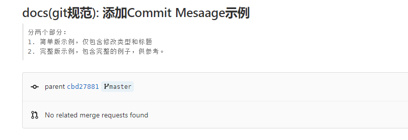

# GIT 流程

如果没有用过git 或者对git不熟悉，建议至少把[Pro Git book](https://git-scm.com/book/zh/v2)前三章读一遍。

1. 如果没有克隆代码，先克隆远程代码到本地
   ```
   git clone http://git.software.dimpt.com/optical-net/optical-net-planning.git
   ```
   
2. 本地切换到开发分支
   ```
   git checkout -b dev origin/dev
   ```
   
3. 拉取最新代码
   ```
   git pull
   ```
   
4. 如果本地还有未提交的代码，并且本地的代码别人也有改动，此时就会有冲突，拉不了代码，解决方式：

   1. 先将本地改动的代码保存起来，命令：`git stash` ；
   
   2. 然后再拉取代码：`git pull`；
   
   3. 然后将上面保存的代码还原： `git stash apply` ，此时会提示需要解决冲突，解决冲突即可。
   
5. 本地有改动，需要提交代码时，先将本地代码放入暂存区

   ```
   git add .
   ```

6. 编写提交信息（commit message）
   ```
   git commit -m 'Initial commit'
   ```

7. 提交到远程
   ```
   git push
   ```

# Commit Message 规范

规范提交信息格式对追踪项目的提交历史有很大用处，在参考Angular.js 等项目的规范基础上，总结如下：

## 基本格式

```text
修改类型(影响范围): 标题
<--空行-->
[正文]
<--空行-->
[页脚]
```

<font color='red'>强制</font>：

 - 修改类型
 - 标题

可选：

- 影响范围
- 正文
- 页脚

### 修改类型

用于说明 commit 的类别，参考Angular.js ，觉得挺好，如下:

- **feat**：提交新功能
- **fix**：修复了bug
- **docs**：只修改了文档
- **style**：调整代码格式，未修改代码逻辑（比如修改空格、格式化、缺少分号等）
- **refactor**：代码重构，既没修复bug也没有添加新功能
- **perf**：性能优化，提高性能的代码更改
- **test**：添加或修改代码测试

### 影响范围

scope用于说明 commit 影响的范围，比如数据层、控制层、视图层，哪个模块等等。视项目不同而不同。

如果不止一个，可以用*替代，也可以不写。

### 标题

每个提交必须有准确简略的标题，能够反映本次改动的信息，尽量在50个字之内。

一般项目都有类似jira等这样的项目管理平台，有条件的话，要做到每次提交代码都在项目管理平台有所体现，这样可以最大化保证项目提交的可追溯性，防止后续因为需求问题导致逻辑不明确等。所以在标题需要体现任务单号。

建议格式：

> 任务单号-具体的标题

### 正文与注脚

部分是对本次 commit 的详细描述，可以分成多行。

我们不需要注脚，可以省略。

## 示例

仅包含**修改类型(影响范围): 标题**示例：

```
docs(git规范): 修复`feat`显示问题
```

完整版示例：

在用git 命令添加多行信息时，可以使用回车来换行。

```
docs(git规范): 添加Commit Mesaage示例：

分两个部分：
1. 简单版示例，仅包含修改类型和标题
2. 完整版示例，包含完整的例子，供参考。
```



# 注意点

- 在公共分支上不要用`git rebase` 命令，因为可能改变commit id，导致提交历史混乱 

# 参考：

- [Pro Git book](https://git-scm.com/book/zh/v2)
- [git commit 规范指南 - 简书 (jianshu.com)](https://www.jianshu.com/p/201bd81e7dc9)
- [Git不完全使用指南 - merge和rebase | 明月逐人归 (mingshan.fun)](https://mingshan.fun/2018/12/23/merge-rebase/)
- [Git 使用规范流程 - 阮一峰的网络日志 (ruanyifeng.com)](http://ruanyifeng.com/blog/2015/08/git-use-process.html)

