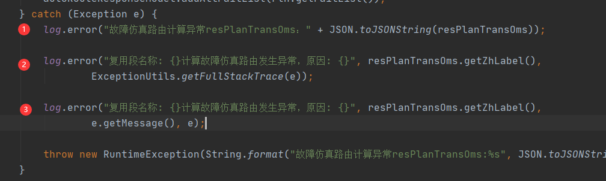

# 记录格式规范

说明：日志是用来排查业务问题的，所以在打日志时需要把必要的业务信息记录下来。

## 凡是在业务代码中出现catch的地方，必须要有日志记录，记录详细的堆栈信息。

上面1处的代码有以下问题：

1. 直接用序列化方式：`JSON.toJSONString()` 太重了，性能有损耗，还有可能报错；日志只需要记录下关键信息，比如是哪个oms，便于快速定位。
2. 日志信息记录不明确，仅记录发生了异常，发生了什么异常？不清楚，这对问题排查没有任何参考价值，建议此时直接把堆栈信息打出来。一些特殊异常，比如系统发生的空指针异常，message里面是没有信息，仅记录e.getMessage没有参考价值
3. 重新抛出异常时，没有必要重写异常日志，因为已经记录过了，让上游拿到最真实的异常即可。

第二种写法是在记录时就把异常堆栈用流的形式输出出来， 如果日志采用异步写入磁盘模式，会消耗性能。所以这个有一个优化点，在采用异步收集日志时，比如使用Disruptor时，可以将发生的异常也放入消息体里面，等到消费端再去处理具体的异常信息。

上面最推荐的是第三种写法。

**备注：**

后续在接入分布式链路追踪时，会将traceId记录到日志文件里面，不过采用无侵入的形式，不会修改上述规范。

